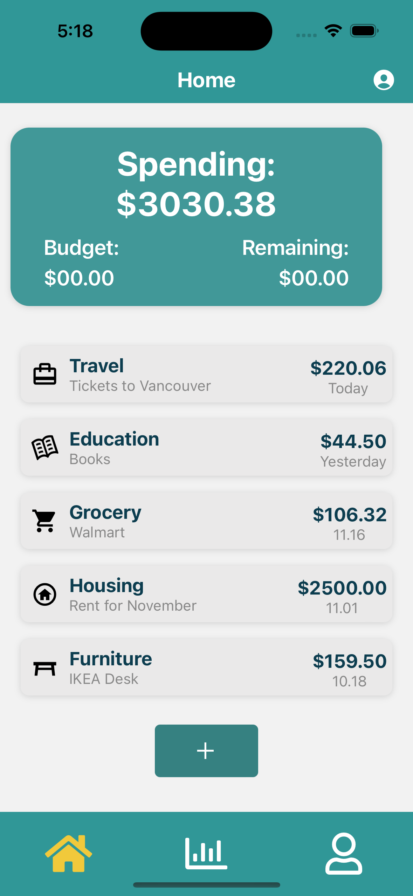
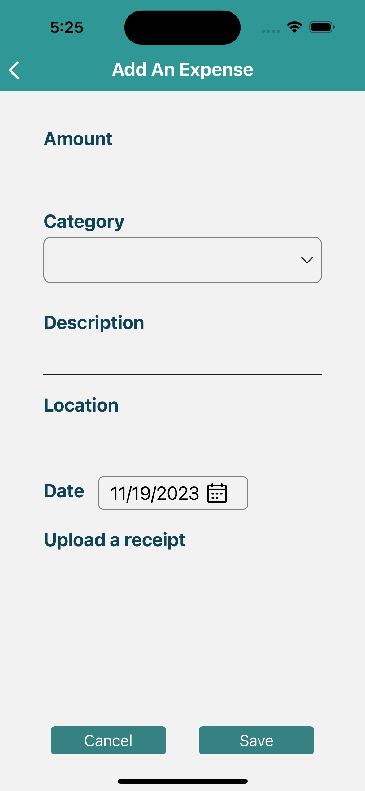
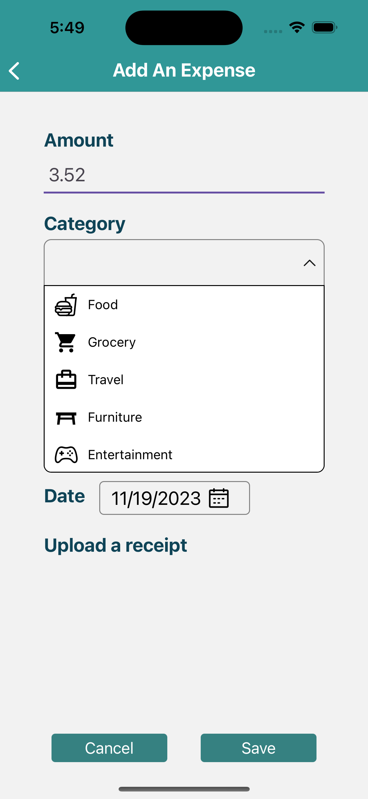
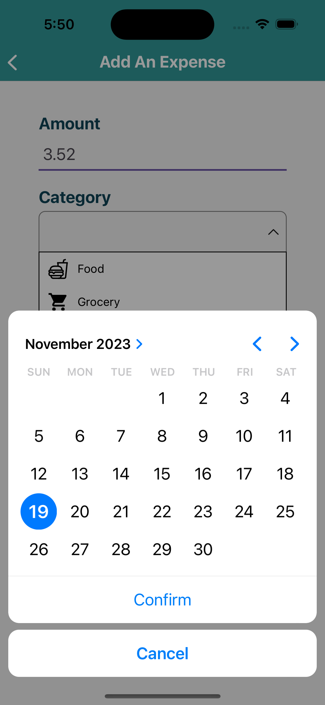
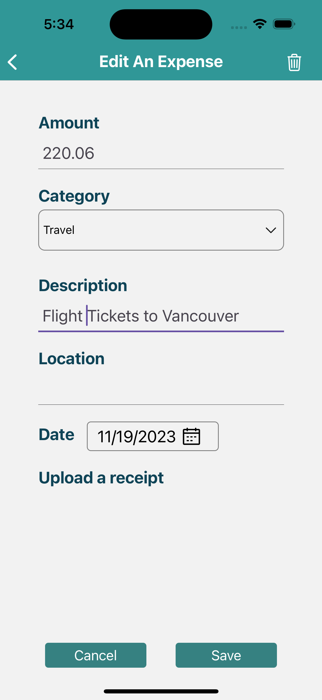
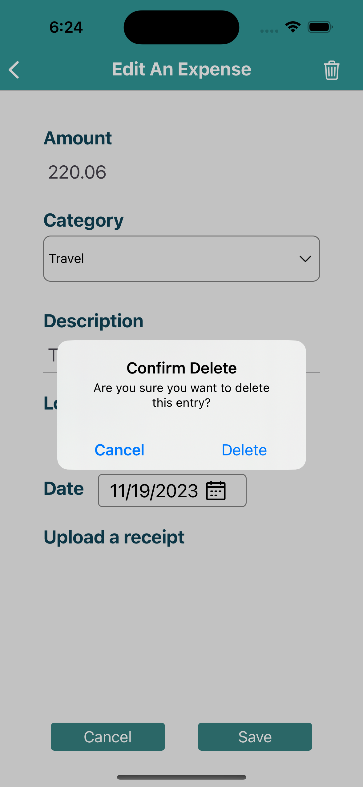

##   APP Name: Budget-Defender
###    Authors: Shaoyujie(Fiona) Chen, Yunke Li

####    Iteration1:
####    Data Modal and Collections:
#####   Users Collection:
This is a top-level collection. Each document in the Users collection represents a user of our application. It has these fields:

-   "uid": "user_unique_id",
-   "email": "user@example.com",
-   "displayName": "User Name",
-   "createdAt": Timestamp,

#####   Expenses Collection:
This is a top-level collection. Each document in the Expenses collection represents a single expense entry created by a user. It has these fields:
 
-   "amount": 100.0,
-   "category": "Grocery",
-   "description": "Weekly grocery shopping",
-   "date": Timestamp,
-   "location": Location,
-   "photo": "photo uri",
-   "user": "user_unique_id",

#####   Budgets Collection:
Budgets collection is a subcollection of the Users Collection. Each document in the Budgets collection represents the budget information for a user. It has these fields:

-   "limit": 3000.0,
-   "user": "user_unique_id",

#####   Categories Collection:
Categories collection is a subcollection of the Users Collection. Each document in the Categories collection represents a unique expense category. It has these fields:

-   "name": "Newly-created category",
-   "user": "user_unique_id",

**Home Screen**

On the home screen, the user can see all spending totals and can see the set budget limit and available balance (to be implemented later). The user can also see the entries of recently added expenses and can click on each entry. The spending entries are sorted by date in descending order and show the category, description, amount and date. At the bottom, there is an Add button, click on the button, users can jump to the "Add An Expense" screen.

**Add An Expense Screen**

  

On the "Add An Expense" screen, users can enter the amount of money spent, select the category, enter a description (optional), a location (optional, to be implemented later), and a date. The amount spent must be a number with at most two decimals, the category cannot be empty, and the date must be today or earlier, or the APP will alert the users. Upon clicking Save, the expense will be upload to the database, and users can see that expense immediately on Home Screen and both All Expenses Screen.

**All Expense Screen**

The All Expense Screen currently shows all the expenses created by the logged in user, we will implement more functions on this screen later. For now, users can click each entry, and go into "Edit An Expense" screen to edit that expense's information.

**Edit An Expense Screen**

 

The Edit An Expense screen looks similar to the Add An Expense screen, the difference is that when users go into the screen, it is already filled with the information the users saved last time. After the user clicks Save, there will be a pop up alert to double confirm, then this expense will be updated and displayed on the Home screen and All Expense screen. And, in the upper right corner of the Edit An Expense screen, there is a trash can icon, when the user clicks on it, it will double confirm if the user wants to delete it, if yes, then the expense will be deleted.