#   APP Name: Budget-Defender
### Budget Defender is a financial management Cross-Platform Native Mobile Application. It delivers features for detailed expense tracking, budget oversight, and analytical financial reporting.
###    Authors: Shaoyujie(Fiona) Chen, Yunke Li

<!-- ##    Iteration1: overall stucture, navigation, and basis of CRUD operations to Firestore -->
##    Iteration2: Authentication, Camera use, and External API use
###    Data Modal and Collections:
####   1. Users Collection:
This is a top-level collection. Each document in the Users collection represents a user of our application. It has these fields:

-   "uid": "user_unique_id",
-   "email": "user@example.com",
-   "displayName": "User Name",
-   "createdAt": Timestamp,

####  2. Expenses Collection:
This is a top-level collection. Each document in the Expenses collection represents a single expense entry created by a user. It has these fields:
 
-   "amount": 100.0,
-   "category": "Grocery",
-   "description": "Weekly grocery shopping",
-   "date": Timestamp,
-   "location": Location,
-   "photo": "photo uri",
-   "user": "user_unique_id",

####  3. Budgets Collection:
Budgets collection is a subcollection of the Users Collection. Each document in the Budgets collection represents the budget information for a user. It has these fields:

-   "limit": 3000.0,
-   "user": "user_unique_id",

####  4. Categories Collection:
Categories collection is a subcollection of the Users Collection. Each document in the Categories collection represents a unique expense category. It has these fields:

-   "name": "Newly-created category",
-   "user": "user_unique_id",

### Screens
#### Auth Stack Screens
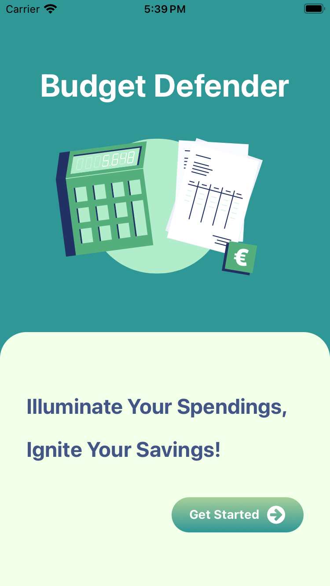 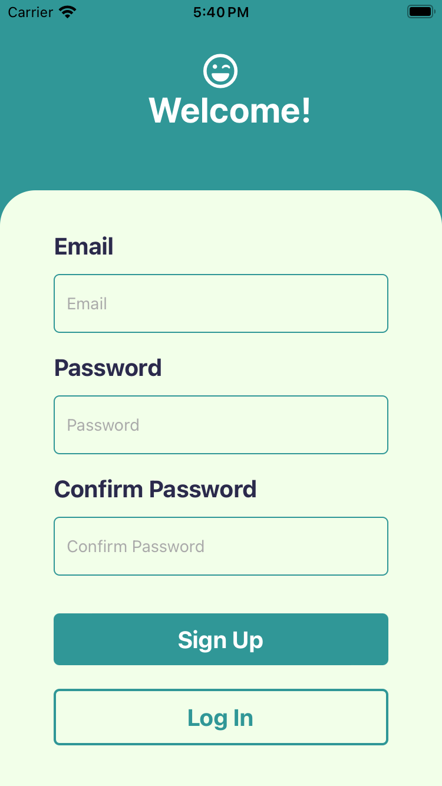 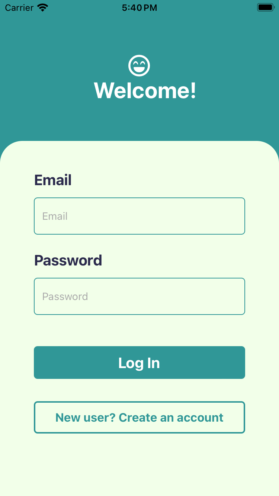

Iteration2 updates the overall UI design of Auth Stack Screens using Lottie an Animatable libraries.

The Auth Stack has three screens, including Welcome Screen, Sign Up Screen and Log In Screen. The Welcome Screen will appear when the user first open this app, and allow users to either signup or login to the app. The Log In Screen and Sign Up Screen can navigate to each other through informative buttons.

  

The Log In Screen and Sign Up Screen follow Admin Authentication API Errors of Firebase, and show alerts to the main errors like invalid email format, weak password, mismatch password, etc.

#### App Stack Screens
#### Iteration2 enables camera use of Add An Expense Screen and Edit An Expense Screen.
#### Iteration2 enables external API use on Currency Exchange Tool Screen.

**Home Screen**

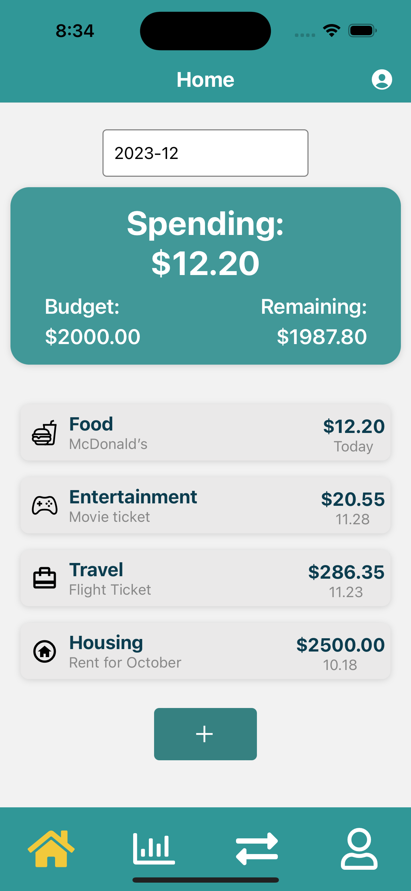 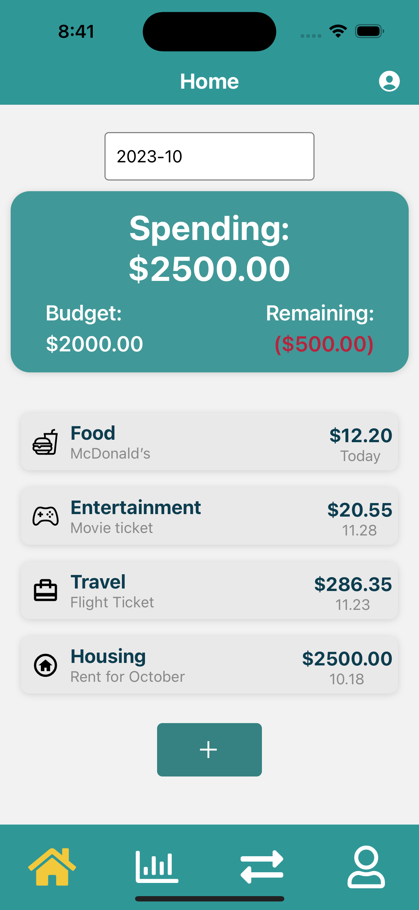

On the home screen, the user can see monthly spending totals, the set budget limit and available remaining money. The default month is the current month, and users can also select any of the past 12 months to view the summary.
The user can also see the entries of recently added expenses and can click on each entry. At the bottom, there is an Add button, click on the button, users can go to the "Add An Expense" screen.

**Add An Expense Screen**

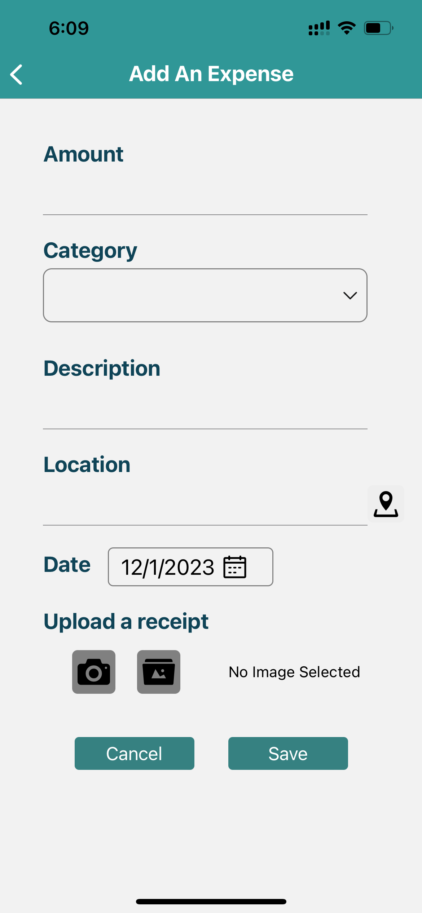 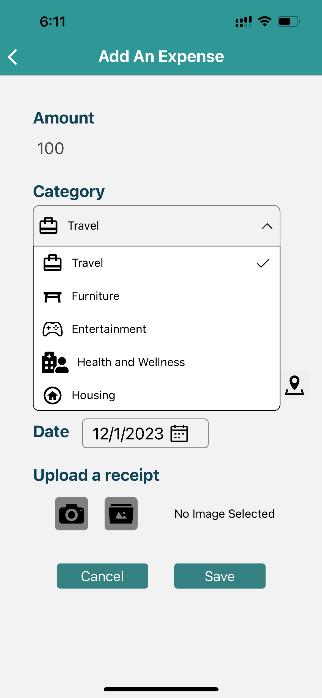 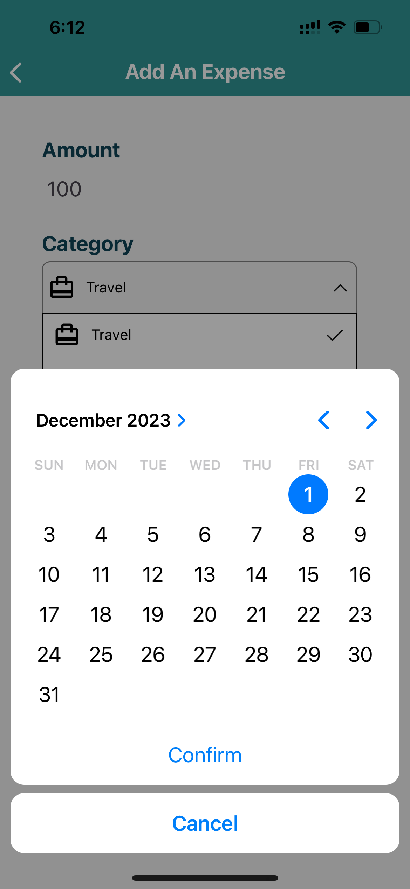 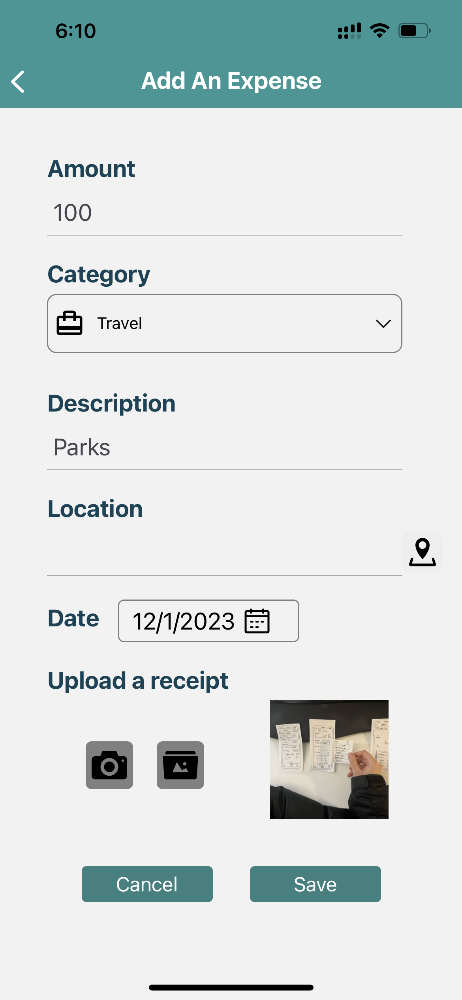
 
On the "Add An Expense" screen, users can enter the amount of money spent, select the category, enter a description (optional), a location (optional, to be implemented later), a date, and upload an image from either camera or album (optional). The amount spent must be a number with at most two decimals, the category cannot be empty, and the date must be today or earlier, or the APP will alert the users. Upon clicking Save, the expense will be upload to the database, and users can see that expense immediately on Home Screen and both All Expenses Screen.

**All Expense Screen**

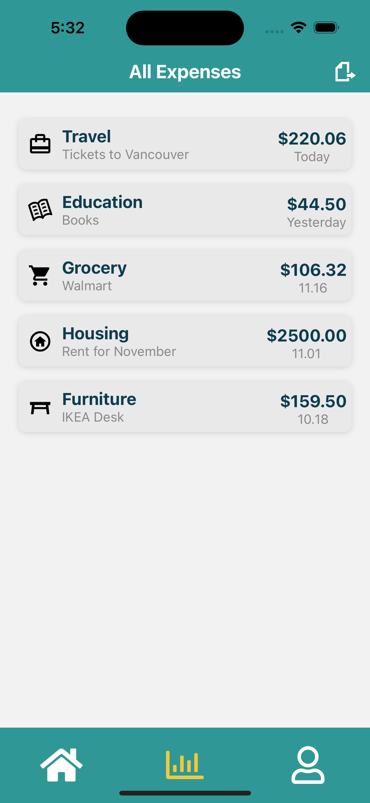

The All Expense Screen currently shows all the expenses created by the logged in user, we will implement more functions on this screen later. For now, users can click each entry, and go into "Edit An Expense" screen to edit that expense's information. The spending entries are sorted by date in descending order and show the category, description, amount and date.

**Edit An Expense Screen**

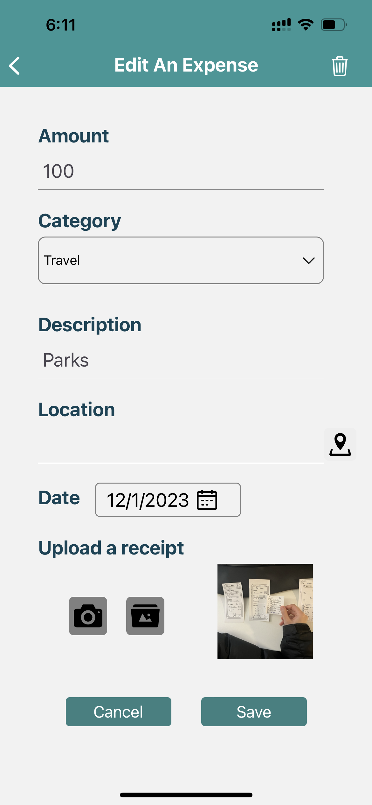 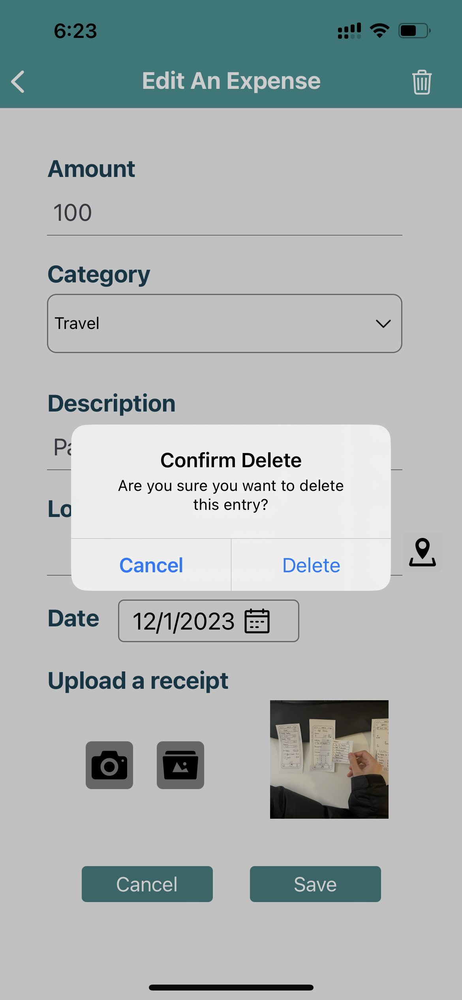

The Edit An Expense screen looks similar to the Add An Expense screen, the difference is that when users go into the screen, it is already filled with the information the users saved last time. After the user clicks Save, there will be a pop up alert to double confirm, then this expense will be updated and displayed on the Home screen and All Expense screen. And, in the upper right corner of the Edit An Expense screen, there is a trash can icon, when the user clicks on it, it will double confirm if the user wants to delete it, if yes, then the expense will be deleted.

**Currency Exchange Tool Screen**
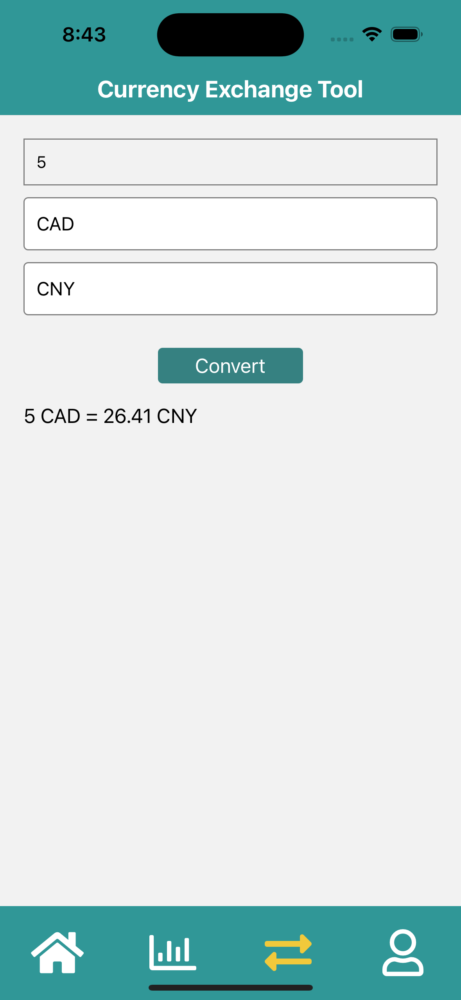

The Currency Exchange Tool screen allows the users to convert exchange rates by entering the amount to be converted, the currency to be converted and the wanted currency. After pressing the "Convert" button, the result of the exchange rate conversion will appear on the screen. This page uses the external API "exchange-api".

**Location Screen (under implementation)**

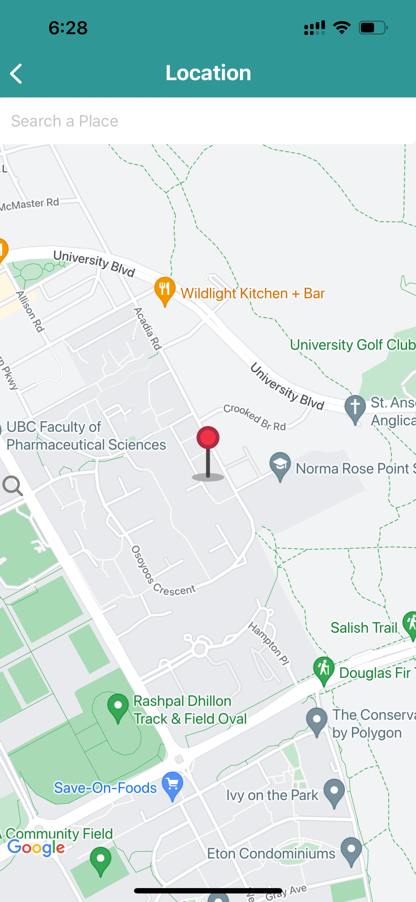 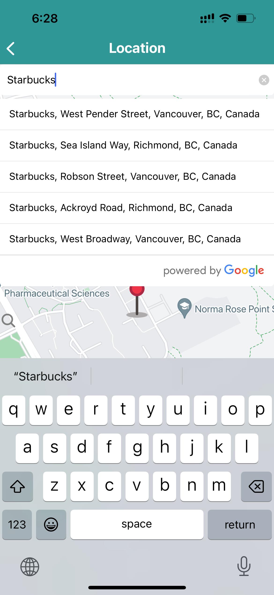

When user clicks on the location icon of Add An Expense screen, the app will navigate to the Location screen with a map, and the marker shows the user's current location. This screen also includes a search box with google autocomplete. In next iteration, user will be able to select a location on the map and save/edit it with other fields of Expense Entry.

**Profile Screen (under implementation)**
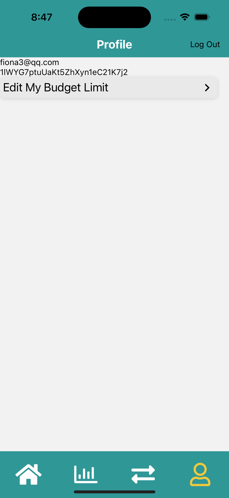 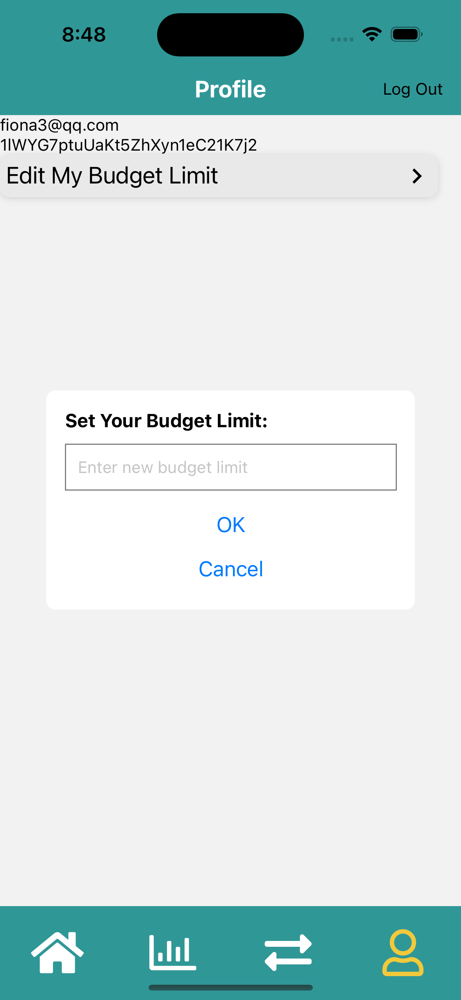

The Profile screen currently has "Edit My Budget Limit" function implemented. By clicking it, there will be a pop-up window for users to change their budget limit. Once the budget limit changed, the summary numbers on Home screen will also change accordingly.