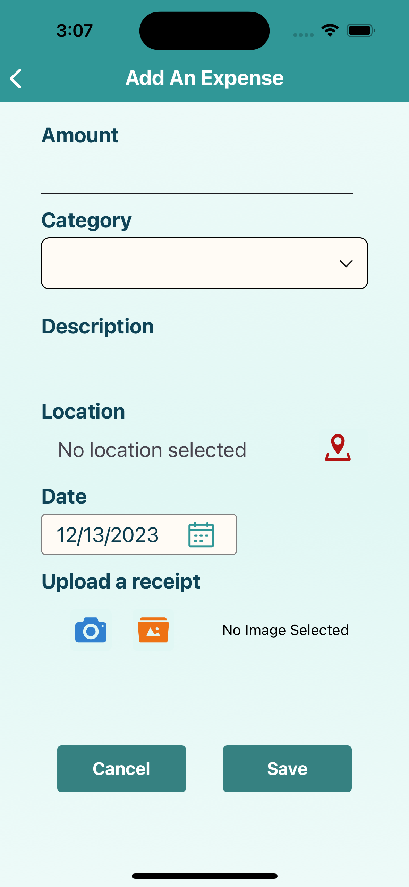
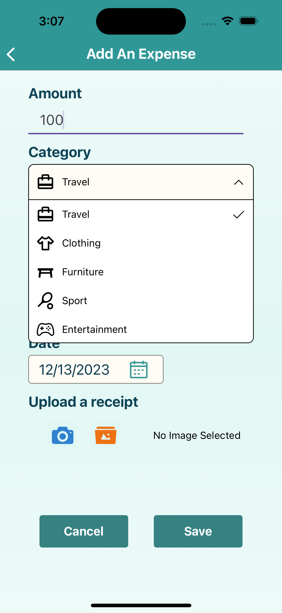
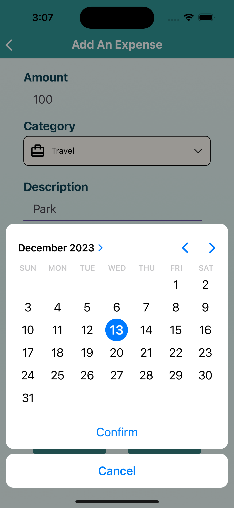
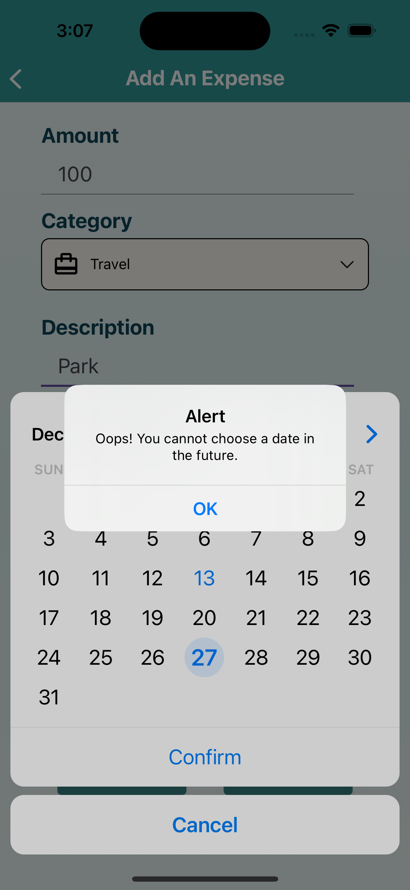
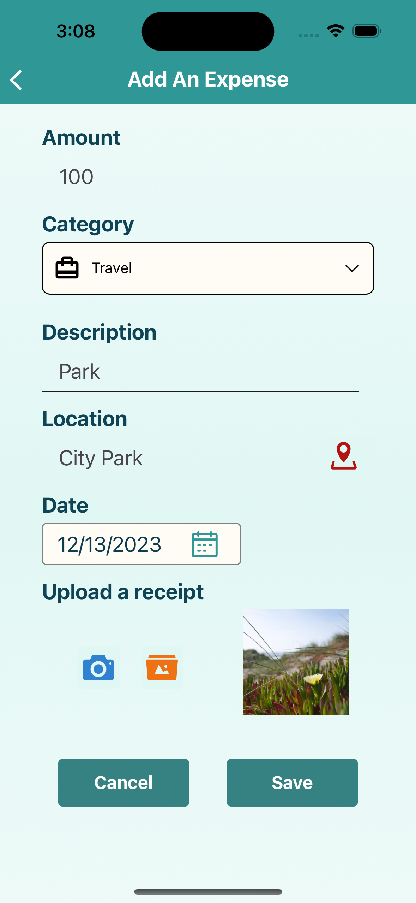
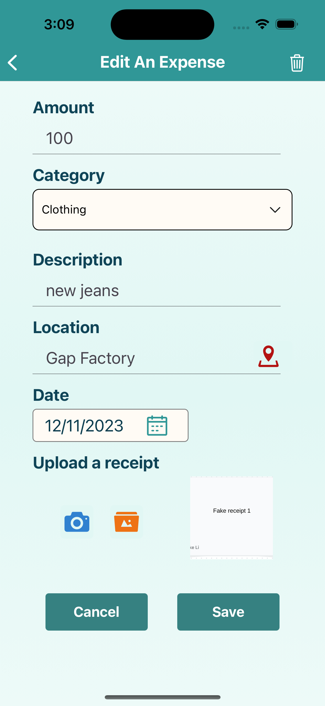
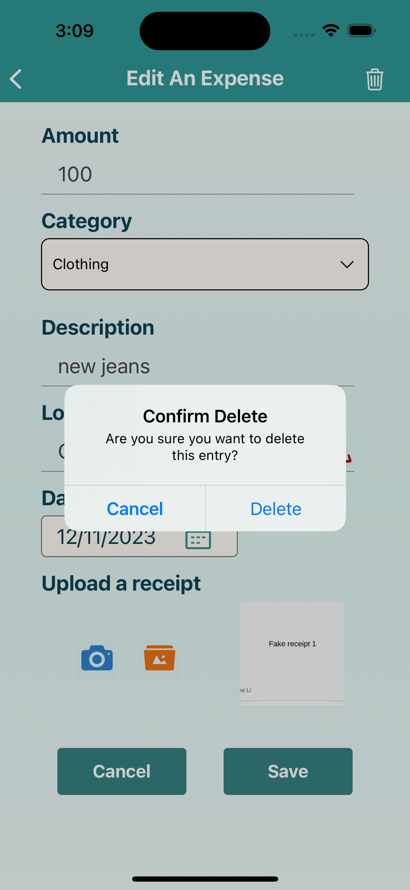

#   APP Name: Budget-Defender
### Budget Defender is a financial management Cross-Platform Native Mobile Application. It delivers features for detailed expense tracking, budget oversight, and analytical financial reporting.
###    Authors: Shaoyujie(Fiona) Chen, Yunke Li

<!-- ##    Iteration1: overall stucture, navigation, and basis of CRUD operations to Firestore -->
### Demo Video Link: 

##    Data Modal and Collections
#### This app uses Firestore database.
###  1. Users Collection
This is a top-level collection. Each document in the Users collection represents a user of our application. It has these fields:

-   "uid": "user_unique_id",
-   "email": "user@example.com",
-   "displayName": "User Name",
-   "createdAt": Timestamp,

###  2. Expenses Collection
This is a top-level collection. Each document in the Expenses collection represents a single expense entry created by a user. It has these fields:
 
-   "amount": 100.0,
-   "category": "Grocery",
-   "description": "Weekly grocery shopping",
-   "date": Timestamp,
-   "location": [
    address: "9151 Bridgeport Rd, Richmond, BC V6X 3L9, Canada",
    latitude: 49.1930382, 
    longitude: -123.1218312, 
    name: "Costco Wholesale"
    ],
-   "photo": "photo uri",
-   "user": "user_unique_id",

###  3. Budgets Collection
Budgets collection is a subcollection of the Users Collection. Each document in the Budgets collection represents the budget information for a user. It has these fields:

-   "limit": 3000.0,
-   "user": "user_unique_id",

## Screens
### 1. Auth Stack Screens
  

The Auth Stack has three screens, including Welcome Screen, Sign Up Screen and Log In Screen. The Welcome Screen will appear when the user first open this app, and allow users to either signup or login to the app. The Log In Screen and Sign Up Screen can navigate to each other through informative buttons.

  

The Log In Screen and Sign Up Screen follow Admin Authentication API Errors of Firebase, and show alerts to the main errors like invalid email format, weak password, mismatch password, etc.

### 2. App Stack Screens
#### Home Screen

 

On the home screen, the user can see monthly spending totals, the set budget limit and available remaining money. The default month is the current month, and users can also select any of the past 12 months to view the summary.
The user can also see the line chart of expenses history of current selected month, inclusing budget limit line, daily expense line, and accumulated expense line.
At the bottom, there is an Add button, click on the button, users can go to the "Add An Expense" screen.

#### Add An Expense Screen

   
 
On the "Add An Expense" screen, users can enter the amount of money spent, select the category, enter a description (optional), a location (optional), a date, and upload an image from either camera or album (optional). The amount spent must be a number with at most two decimals, the category cannot be empty, and the date must be today or earlier, or the APP will alert the users. Upon clicking Save, the expense will be upload to the database, and users can see that expense immediately on Home Screen and both All Expenses Screen.
 

#### Location Screen

   
 
When user clicks on the location icon of Add An Expense screen, the app will navigate to the Location screen with a map, and the marker shows the user's current location. This screen also includes a search box with google autocomplete API. User can search a location on the map and select it with other fields of Expense Entry.

#### All Expense Screen

 
 
The All Expense Screen shows all the expenses created by the logged in user by month, and a pie chart showing the spendings of each category. 
Users can click on each entry, and go into "Edit An Expense" screen to edit that expense's information. The spending entries are sorted by date in descending order and show the category, description, amount and date.

#### Edit An Expense Screen

 

The Edit An Expense screen looks similar to the Add An Expense screen, the difference is that when users go into the screen, it is already filled with the information the users saved last time. After the user clicks Save, there will be a pop up alert to double confirm, then this expense will be updated and displayed on the Home screen and All Expense screen. And, in the upper right corner of the Edit An Expense screen, there is a trash can icon, when the user clicks on it, it will double confirm if the user wants to delete it, if yes, then the expense will be deleted.

#### Currency Exchange Tool Screen

 

The Currency Exchange Tool screen allows the users to convert exchange rates by entering the amount to be converted, the currency to be converted and the wanted currency. After pressing the "Convert" button, the result of the exchange rate conversion will appear on the screen. The shaking convert icon in the middle can be clicked to exchange the upper and lower picker's currency. This page uses the external API "exchange-api".

#### Profile Screen

The Profile screen includes a user profile box and four setting options. The profile box is made with user name and avatar, My Visited Places and My Receipts buttons. On the top right conner is a log out button.

The four setting options are as follows:

   

- Edit Profile: let user change username and avatar
- Edit Budget Limit: let user change monthly budget limit
- Change Password: let user change and confirm new password
- Notifications Setting: let user choose to receive notifications

#### Visited Places Screen
   

When click on My Visited Location button on Profile Screen, it will navigate to a map showing all the places the user has visited so far. Locatios are shown with different markers representing the frequency of visiting. User can select the filter to view different levels and check the location's name and address.

#### My Receipts Screen
 

When click on My Receipts button on Profile Screen, it will navigate to an album showing all the receipts, each with its location name and date. The receipts can be clicked to zoom-in/out and slide to next image.